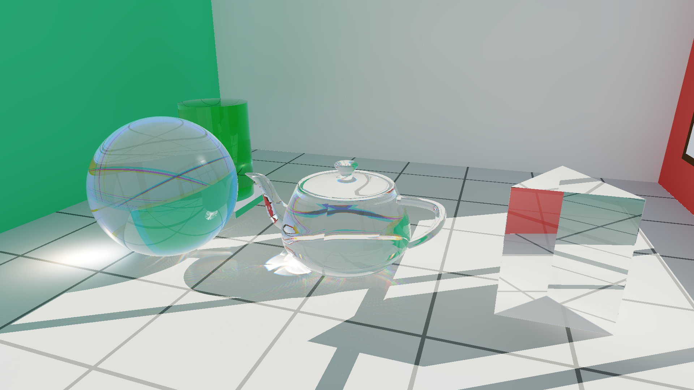
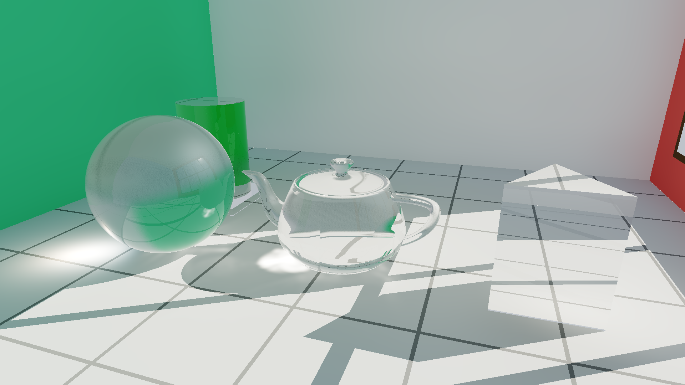
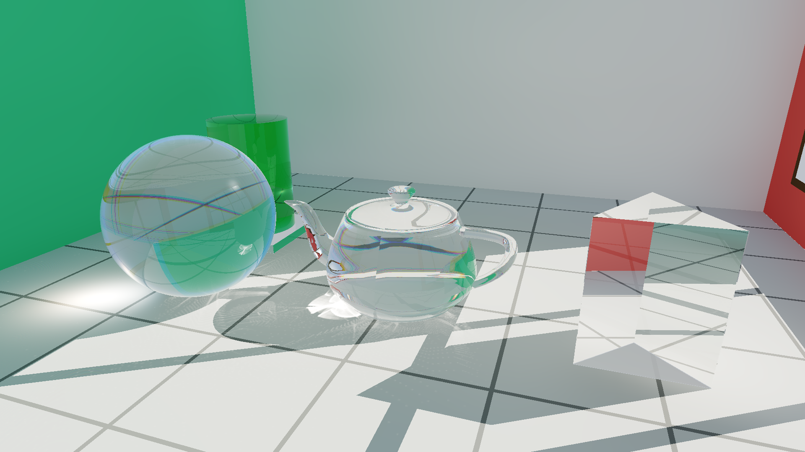
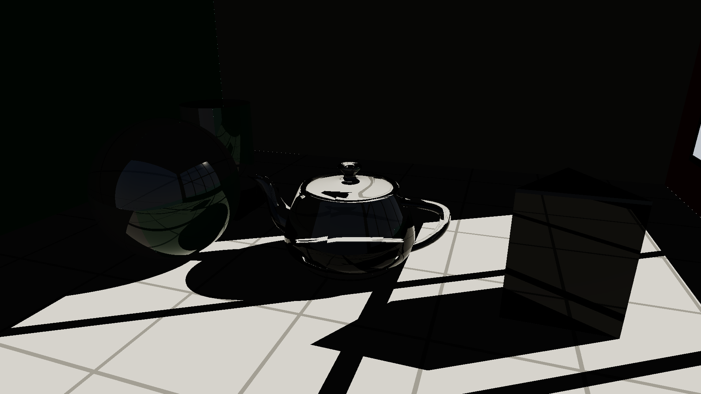
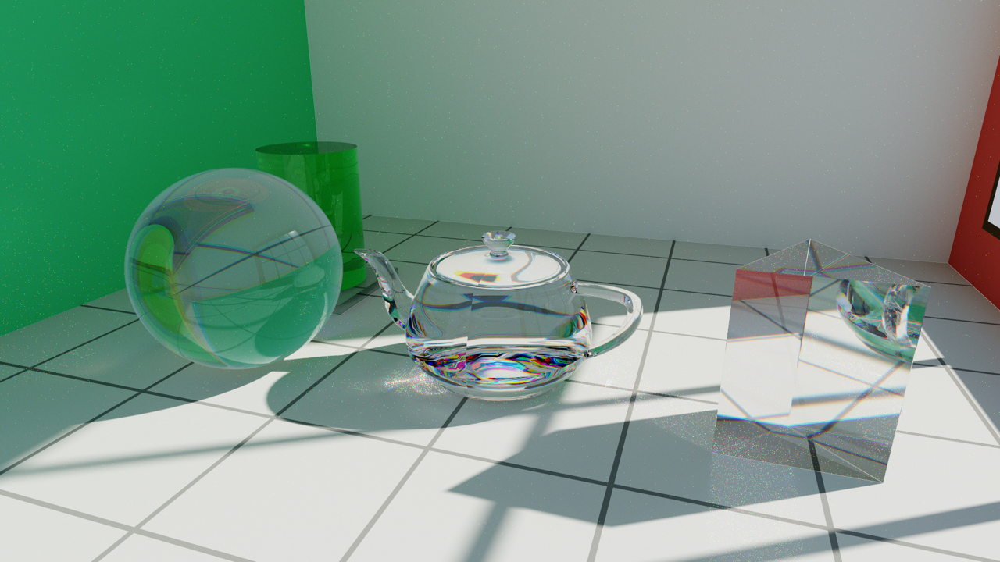
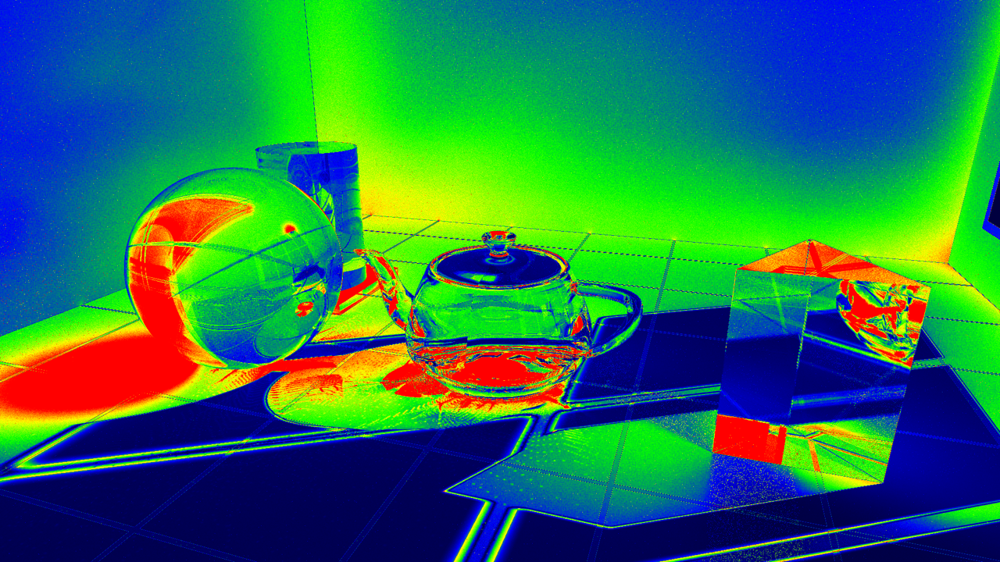

# Radiance Cascades Glass & Caustics

A real-time ray tracer for glass: refraction with dispersion, forward-splatted floor caustics, and a cascaded irradiance cache for the indirect bounce. Three separate backends - Apple Metal, Vulkan 1.2+, and OpenGL 4.3+ Core - share the scene definition and the mesh loader.

<p align="left">
  <a href="https://www.instagram.com/blacklineinteractive"></a>
  <a href="https://t.me/blacklineinteractive"></a>
  <a href="https://youtube.com/@blacklineinteractive"></a>
  <a href="https://www.linkedin.com/in/blacklineinteractive"></a>
</p>



---

## Important Notice & Disclaimer

> [!WARNING]
> **Experimental Demo / Proof of Concept**
> This repository is an **experimental research demo and educational prototype**. It explores the application of Radiance Cascades principles to complex dielectric transmission and real-time caustic generation. Because it is a proof-of-concept, it may contain physical simplifications, mathematical approximations, edge-case inaccuracies, or implementation bugs. It is not intended as a drop-in production rendering library.

> [!NOTE]
> **Developer Note & AI Assistance**
> AI was used to assist in writing this code due to the high barrier of entry and complexity of Vulkan, as well as to help grasp the intricate mathematics behind Radiance Cascades. It is disheartening to see a double standard in the graphics community where massive corporations are praised for AI generation (e.g., DLSS 5), while solo developers releasing completely free, open-source code with full author attribution are heavily criticized. I am learning, sharing my journey, and hoping to make these complex techniques more accessible.

---

## Attribution & Credits

The **Radiance Cascades** algorithm was conceived and pioneered by **Alexander Sannikov**, who introduced the concept in his 2023/2024 research:

- **Alexander Sannikov** - *"Radiance Cascades: A Novel Approach to Calculating Global Illumination"* (2023/2024).
- Repository: [https://github.com/Raikiri/RadianceCascadesPaper](https://github.com/Raikiri/RadianceCascadesPaper)
- Direct PDF: [RadianceCascades.pdf](https://github.com/Raikiri/RadianceCascadesPaper/blob/main/out_latexmk2/RadianceCascades.pdf)

What this project borrows from that work is the interval partition and the far-to-near merge. It is not a faithful implementation - see [What is and isn't Radiance Cascades here](#what-is-and-isnt-radiance-cascades-here) for where it departs.

---

## Technical Overview

Glass is awkward for a real-time path tracer: refraction through two interfaces is specular, so the paths that matter are exactly the ones importance sampling finds slowly, and the caustics they produce are the noisiest part of the image. This demo sidesteps that by never sampling those paths backwards.

The frame is five compute passes:

1. **Cascaded irradiance** - a 64x64 probe grid per room surface (five surfaces packed into one 320x64 atlas) gathers indirect light over four non-overlapping distance intervals, merged far-to-near. Result is diffuse irradiance only; specular refraction is handled separately in the shading pass.
2. **Atlas filter** - 7x7 Gaussian over each surface, so probe noise does not show up as blotches on the walls.
3. **Caustic splatting** - one photon per thread, refracted through a glass object and projected onto the floor. Because photons land wherever they land, the accumulation buffer is integer and the splat is a bilinear `atomic_fetch_add` into fixed point.
4. **Caustic filter** - reads the integer buffer back into a float texture, with an extra roughness-driven blur in frosted mode.
5. **Shading** - one primary ray per pixel. Glass gets a Fresnel-weighted split between a reflection ray and an interior walk traced per channel (R/G/B use different IOR, which is what produces the coloured fringes). The interior walk follows up to four internal reflections: at each exit interface the Fresnel-transmitted part leaves and is shaded, the reflected part stays inside, and a failed refraction is total internal reflection that keeps everything inside. Glass occludes the sun's shadow ray, so the beam it deflects returns only through the caustic splat.

A sixth kernel, mode 4, is a brute-force path tracer over the same scene. It is not part of the frame - it is the ground truth the five passes above are measured against, and the measurements are in [Validation against a path traced reference](#validation-against-a-path-traced-reference).

Dispersion uses a Cauchy-style split, $n(\lambda) = n_0 + B/\lambda^2$, collapsed to three fixed offsets rather than a real spectral sampling. Internal attenuation is Beer-Lambert, $I(d) = I_0 e^{-\alpha d}$. The teapot (6,320 triangles) sits in a 4,095-node linear BVH traversed with a 64-entry stack and near-child ordering; everything else in the scene is an analytic primitive.

---

## Visual Gallery

| Mode 1: Clear Glass & Floor Caustics | Mode 2: Frosted / Rough Glass |
| :---: | :---: |
|  |  |
| *Snell refraction, Cauchy dispersion, floor photon caustics* | *Cone-jittered transmission & diffused caustic filter* |

| Mode 3: Newton Prism Dispersion | Mode 0: Whitted RT Baseline |
| :---: | :---: |
|  |  |
| *Amplified spectral separation on prism & crystal sphere* | *Classical binary shadow ray (zero caustics, dark shadow)* |

| Mode 4: Path Traced Reference | Error against that reference |
| :---: | :---: |
|  |  |
| *2048 spp ground truth, 185 s per frame* | *Mode 1 minus reference, blue 0 to red 0.25* |

---

## Optical Modes

| Mode | Identifier | Description |
| :---: | :--- | :--- |
| **Mode 1** | **Realistic Glass + Caustics** | Snell refraction, Fresnel reflection, Cauchy spectral dispersion, floor caustics splatting, and radiance cascade GI. |
| **Mode 2** | **Frosted / Rough Glass** | Micro-roughness transmission cone sampling, softened refraction, and Gaussian-diffused caustic footprints. |
| **Mode 3** | **High Spectral Dispersion** | Exaggerated Cauchy coefficients on crystal spheres and Newton's triangular prism, displaying distinct spectral separation. |
| **Mode 0** | **Whitted Baseline** | Classical recursive ray tracing with binary shadow testing (no caustics, dark glass shadows). |
| **Mode 4** | **Path Traced Reference** | Brute-force progressive path tracing of the same scene - the ground truth the other four modes are measured against. Not real-time. |

---

## Architecture & Backends

The three backends are independent hosts over a shared scene definition and mesh loader. They are not quite feature-identical: the Metal cascade gather traces glass and feeds the previous frame's atlas back in for a second bounce, while the GLSL one skips both and uses a flat ambient term.

```
radiance_cascades_glass/
├── assets/
│   ├── teapot.bin              # 6,320 triangles, 4,095 BVH nodes binary mesh
│   └── TeapotData.h            # Binary-aligned C++17 loader & GPU structs (48B BVH, 96B tri)
├── common/
│   ├── Camera.h                # Unified OrbitCamera (Apple SIMD & GLM)
│   ├── scene_rt.glsl           # Shared GLSL constants, structs & tone mapping
│   └── scene_intersect.glsl    # BVH traversal & analytical intersection routines
├── Metal/
│   ├── src/main.mm             # Native Cocoa / MetalKit application host
│   ├── shaders/                # Metal Shading Language compute kernels
│   └── build.sh                # Standalone Metal build script
├── Vulkan/
│   ├── src/main.cpp            # Vulkan 1.2+ compute pipeline host (GLFW)
│   ├── shaders/                # GLSL compute shaders (compiled to SPIR-V)
│   ├── CMakeLists.txt          # Standalone Vulkan CMake configuration
│   └── build.sh                # Standalone Vulkan build script
├── OpenGL/
│   ├── src/main.cpp            # OpenGL 4.3+ Core host with compute dispatches
│   ├── src/gl_loader.h/.cpp    # Standalone GL 4.3 function loader (GLFW_INCLUDE_NONE)
│   ├── shaders/                # OpenGL 4.3 Core GLSL compute shaders
│   ├── CMakeLists.txt          # Standalone OpenGL CMake configuration
│   └── build.sh                # Standalone OpenGL build script
├── media/                      # High-resolution benchmark renders
├── output/                     # Benchmark artifacts and snapshot exports
└── CMakeLists.txt              # Unified root build configuration
```

### Backend Comparison

| Feature | Apple Metal | Vulkan 1.2+ | OpenGL 4.3+ Core |
| :--- | :---: | :---: | :---: |
| **Language** | MSL (C++14 based) | GLSL $\to$ SPIR-V | GLSL 430 / 450 |
| **Compute Passes** | 10 Pipelines (9 + path traced reference) | 9 Pipelines | 9 Programs |
| **Memory Barriers** | Implicit / Metal Fences | Explicit `VkMemoryBarrier` | `glMemoryBarrier` |
| **Shader Storage** | `device const T*` | SSBO (`std430`) | SSBO (`std430`) |
| **Platform Target** | macOS (Native) | Cross-platform / MoltenVK | Linux / Windows / Mesa |
| **Path traced reference (mode 4)** | yes, with the validation studies | not yet ported | not yet ported |
| **Measured (AMD Radeon Pro 5500M)** | 60 fps (16.5 ms) interactive / ~51 fps clear @1080p | 69 fps clear / 47 fps frosted @720p, via MoltenVK | not benchmarked (macOS caps GL at 4.1, no compute) |

---

## Building and Running

### Prerequisites

#### macOS

```bash
# Install Homebrew dependencies
brew install cmake glfw glm vulkan-headers vulkan-loader molten-vk glslang
```

#### Ubuntu / Debian Linux

```bash
sudo apt update
sudo apt install -y cmake g++ libvulkan-dev vulkan-tools libglfw3-dev libglm-dev glslang-tools
```

#### Windows

Install the [Vulkan SDK](https://vulkan.lunarg.com/), [CMake](https://cmake.org/), and install `glfw` and `glm` via [vcpkg](https://github.com/microsoft/vcpkg).

---

### Method 1: Unified CMake (Recommended)

From the project root:

```bash
cmake -B build -S .
cmake --build build -j
```

This automatically detects available SDKs and compiles:

- `build/rc_glass_app` (Metal on macOS)
- `build/Vulkan/rc_glass_vk` (Vulkan)
- `build/OpenGL/rc_glass_gl` (OpenGL 4.3+)

---

### Method 2: Standalone Backend Scripts

Each backend includes an independent build script:

```bash
# Build & run Apple Metal
cd Metal && ./build.sh && ./rc_glass_app

# Build & run Vulkan
cd Vulkan && ./build.sh && ./rc_glass_vk

# Build & run OpenGL (Linux / Windows / Mesa)
cd OpenGL && ./build.sh && ./rc_glass_gl
```

---

## Interactive Controls

| Control | Action |
| :--- | :--- |
| **Left Click + Drag** | Orbit camera around target |
| **Option + Drag** | Pan camera horizontally & vertically |
| **Right Click + Drag / Scroll** | Zoom camera in / out |
| **Space** | Toggle animated sun orbit |
| **Arrow Keys** | Manually adjust sun elevation and azimuth |
| **1** | Switch to **Mode 1** (Realistic Clear Glass + Caustics) |
| **2** | Switch to **Mode 2** (Frosted Rough Glass) |
| **3** | Switch to **Mode 3** (High Spectral Dispersion Prism) |
| **0** | Switch to **Mode 0** (Whitted Ray Tracing Baseline) |
| **4** | Switch to **Mode 4** (Path Traced Reference - progressive ground truth) |
| **+ / -** | Increase / decrease glass surface roughness |
| **[ / ]** | Internal reflection budget inside glass (1-8, default 1) |
| **B** | Cycle sunlight brightness (6 modes: 0.8x - 10.0x) |
| **C** | Cycle light color (Normal - Smooth RGB rainbow - Stepped sharp RGB) |
| **O** | Toggle hardware & performance stats overlay (GPU, load, VRAM, RAM, FPS) |
| **R** | Reset camera to default perspective |
| **S** | Capture high-resolution screenshot to `output/` |
| **Esc** | Exit application |

---

## Headless Benchmarking & CLI Options

Every backend takes `--headless`, which renders all four modes and writes PNGs to `output/` (Metal renders at 1080p, Vulkan and OpenGL at 720p):

```bash
# Run 4-mode automated headless benchmark on Metal
./Metal/rc_glass_app --headless

# Run 4-mode automated headless benchmark on Vulkan
./Vulkan/rc_glass_vk --headless

# Run on OpenGL
./OpenGL/rc_glass_gl --headless
```

### CLI Arguments

- `--headless` or `--benchmark`: Renders all four real-time modes, timing 20 frames each after 3 warm-up frames, then a 64 spp path traced frame, and writes PNGs to `output/`.
- `--1080p` or `--1080`: (Metal) Launches interactive rendering directly in 1920x1080p resolution.
- `--res <WxH>`: Sets render resolution (e.g. `1920x1080`).
- `--teapot <path>`: Specifies custom path to `teapot.bin` mesh data.
- `--shader <path>`: (Metal only) Specifies custom compiled `.metallib` path.

### Validation Runs (Metal)

Three offline studies compare the real-time modes against the mode 4 path tracer. All three write PNGs and error heat maps to `output/`.

```bash
# Every mode against its own path traced reference
./Metal/rc_glass_app --compare --res 1920x1080 --ref-spp 2048

# What the path tracer gets for one real-time frame time, and how much it needs to catch up
./Metal/rc_glass_app --equal-time --res 1920x1080 --ref-spp 2048 --max-spp 1024

# What each pass is worth, in milliseconds and in error
./Metal/rc_glass_app --ablation --res 1920x1080 --ref-spp 2048
```

| Argument | Meaning |
| :--- | :--- |
| `--ref-spp <n>` | Samples per pixel in the reference. Rendered as two independent halves so the reference reports its own residual noise. |
| `--max-spp <n>` | Upper bound of the equal-time convergence sweep. |
| `--spp-chunk <n>` | Samples per dispatch. Larger is faster, smaller keeps the GPU responsive. |
| `--res <WxH>` | Resolution for the study. |
| `--mode <n>` | Which mode's optics the equal-time and ablation studies use (default 1). |
| `--modes <a,b,c>` | Which modes `--compare` walks (default `1,2,3,0`). |
| `--glass-bounces <n>` | Internal reflection budget inside glass, 1 to 8 (default 1). Raising it lets a reflected ray find a second interior surface instead of being forced straight through - measured to matter on this scene only at grazing angles the default camera doesn't see; see below. |
| `--depth <n>` | Path tracer maximum depth (default 12). |
| `--sun-radius <deg>` | Angular radius of the sun disc in the reference (default 0.5). |
| `--pt-clamp <v>` | Firefly clamp on a single path contribution. `0` (default) leaves the reference unbiased. |

---

## Mathematical Formulations

### 1. Dielectric Fresnel Equations

For unpolarized light with incident angle $\theta_i$ and transmitted angle $\theta_t$:
$$R_s = \left|\frac{n_1 \cos\theta_i - n_2 \cos\theta_t}{n_1 \cos\theta_i + n_2 \cos\theta_t}\right|^2, \quad R_p = \left|\frac{n_1 \cos\theta_t - n_2 \cos\theta_i}{n_1 \cos\theta_t + n_2 \cos\theta_i}\right|^2$$
$$F(\theta_i) = \frac{1}{2} (R_s + R_p)$$

### 2. Snell-Descartes Refraction Vector

Given incident unit direction $\mathbf{I}$, surface normal $\mathbf{N}$, and relative index $\eta = n_1 / n_2$:
$$\cos\theta_i = -\mathbf{N} \cdot \mathbf{I}, \quad \sin^2\theta_t = \eta^2 (1 - \cos^2\theta_i)$$
$$\mathbf{T} = \eta \mathbf{I} + (\eta \cos\theta_i - \sqrt{1 - \sin^2\theta_t}) \mathbf{N}$$
If $\sin^2\theta_t > 1$, Total Internal Reflection (TIR) occurs.

### 3. Bilinear Photon Splatting

Photons intersecting the receiver plane $(x, z)$ distribute energy to surrounding grid cells $(x_0, z_0), (x_1, z_0), (x_0, z_1), (x_1, z_1)$ with bilinear weights:
$$w_{00} = (1 - f_x)(1 - f_z), \quad w_{10} = f_x (1 - f_z), \quad w_{01} = (1 - f_x) f_z, \quad w_{11} = f_x f_z$$
Accumulated into integer SSBO buffers via fixed-point scaling factor $S = 10^9$:
$$\Delta I = \lfloor \Phi \cdot w_{uv} \cdot S \rfloor$$

### 4. Cascaded Irradiance

Four cascades, each owning one segment of the ray and its own probe grid, stored in its own texture:

$$I_c = [r_c, r_{c+1}], \quad \mathbf{r} = \{0.005,\ 0.25,\ 0.80,\ 2.50,\ 100.0\}\ \text{m}$$

Probe density drops 4x in area per level up ($64^2, 32^2, 16^2, 8^2$ per surface), and ray count $M_c$ grows 4x to match ($M_c = 16 \cdot 4^c$, i.e. $16, 64, 256, 1024$), so every level spends the same total ray budget: $\text{probes}^2 \cdot M_c$ is constant across $c$. Each level is a separate compute dispatch, evaluated once, far-to-near - level 3 first (nothing above it, so its residual picks up the sky), then 2, 1, 0, each reading the level above rather than retracing it. A cascade-$c$ ray is traced only inside its own interval, so nothing is intersected twice, and the levels merge:

$$L_c(\vec{\omega}_i) = L_c^{\text{local}}(\vec{\omega}_i) + \tau_c(\vec{\omega}_i) \cdot \tfrac{1}{4}\sum_{k=0}^{3} \hat{L}_{c+1}(\vec{\omega}_{4i+k})$$

$\tau_c$ is the residual transmittance: 1 when the ray leaves the interval unobstructed, and `smoothstep(0.85, 1, t)` when it hits near the far edge, which stops the interval boundary from showing up as a hard ring. $\hat{L}_{c+1}$ is bilinearly interpolated across level $c+1$'s probe grid at the querying probe's position, not read from the single nearest coarse probe - a fine probe generally doesn't sit on a coarse one.

Irradiance is the mean of cascade 0's merged radiance:

$$E(\mathbf{x}) = \frac{1}{M_0}\sum_{k=0}^{M_0-1} L_0(\vec{\omega}_k)$$

There is no explicit $\cos\theta$ term because the directions are drawn cosine-weighted, so the estimator is already the cosine-weighted average.

---

## What is and isn't Radiance Cascades here

The interval partition and the far-to-near merge come straight from Sannikov's formulation. So does the amortization now: each cascade level is its own dispatch, over its own probe grid, evaluated once and read (not retraced) by the level below.

**Cascades are stored, one texture per level.** Level 3 (8x8 probes/surface, 1024 rays) is computed once and read by level 2's 16x16 probes, which is read by level 1's 32x32, down to level 0's 64x64. Ray count quadruples per level (16, 64, 256, 1024) to match the 4x drop in probe density, so every level spends the same total ray budget - `probes^2 * rays` is constant across levels, which is the condition the doubling in an earlier version of this engine was missing (it kept spatial resolution's 4x-per-level drop but only doubled the rays, leaving the coarse cascades angularly under-resolved for the solid angle they cover).

**Coarse probes are read with manual bilinear interpolation**, not snapped to the nearest one, since a fine probe rarely sits exactly on a coarse probe's position. GLSL can't express this as hardware texture filtering here because probes and directions share one image axis (bilinear filtering would blend across unrelated directions), so it's four explicit `imageLoad`s averaged by hand.

What this buys in practice: on the reference scene the old per-texel-retrace scheme spent about 4.9M ray-scene intersections a frame; the amortized version spends about 1.3M for the same four intervals at the corrected (4x) angular scaling - roughly 3.75x fewer traces while fixing the angular deficiency the old version had. On this machine (AMD Radeon Pro 5500M) the Metal cascade pass went from ~42ms to ~14.5ms.

There is still a structural limit that this pass doesn't touch: probes only exist on the five room surfaces, as a 64x64 lightmap each. So this is a surface irradiance cache with a cascaded gather, not a volumetric or screen-space cascade hierarchy. Glass objects have no probes of their own and read a normal-weighted blend of the five walls.

---

## Validation against a path traced reference

Mode 4 is a brute-force path tracer over the same scene, the same materials and the same tone map, and its only job is to be the ground truth the other four modes are measured against. It currently exists in the Metal backend only. Every number in this section was produced by the binary in this repository - the commands are in [Validation Runs](#validation-runs-metal). All measurements are on an AMD Radeon Pro 5500M at 1920x1080.

### What the reference actually solves

The reference is matched to the raster path's conventions on purpose, so that the two images differ by transport error and nothing else:

- The sun is a disc of angular radius 0.5 degrees whose radiance is $\pi \cdot I_{\text{sun}} / \Omega$, which reproduces the raster path's $\text{albedo} \cdot I_{\text{sun}} \cdot \cos\theta$ exactly for an unshadowed diffuse hit.
- The sky is the same `getSkyRadiance()` the cascades gather, so the ambient level is the one the cascade pass is trying to reproduce.
- Glass is a smooth dielectric with a Fresnel-sampled reflect/refract split, Beer-Lambert absorption over each interior segment, and a lazily chosen spectral band for dispersion. In mode 2 it becomes a GGX microfacet dielectric with $\alpha = \text{roughness} \cdot 0.28$, which is what the raster path's exit cone stands in for.
- Direct light is sampled explicitly at diffuse vertices and excluded from the environment on the next bounce, so nothing is counted twice. Glass **occludes** the shadow ray, which is precisely what the raster path does not do.

Every reference is rendered as two independent halves with disjoint seeds. The RMSE between those halves is reported as the reference's own residual noise, and differences smaller than it are not claimed as results. At 2048 spp that floor is **0.0152** RMSE, about 8.7% of the error being measured.

### 1. Distance from ground truth

2048 spp reference per mode, metrics on the tone mapped image in display space. `bias` is the mean signed luminance error: positive means the real-time frame is too bright.

| Mode | frame ms | RMSE | PSNR dB | relMSE | SSIM | bias | RMSE floor | RMSE glass | reference noise |
| :--- | ---: | ---: | ---: | ---: | ---: | ---: | ---: | ---: | ---: |
| 1 clear glass | 32.61 | 0.1383 | 17.19 | 0.1359 | 0.8273 | +0.0830 | 0.1297 | 0.1958 | 0.0152 |
| 2 frosted glass | 31.07 | 0.1385 | 17.17 | 0.1380 | 0.7332 | +0.0936 | 0.1378 | 0.1754 | 0.0218 |
| 3 high dispersion | 34.23 | 0.1383 | 17.19 | 0.1354 | 0.8287 | +0.0830 | 0.1295 | 0.1961 | 0.0151 |
| 0 whitted baseline | 4.47 | 0.4320 | 7.29 | 0.6531 | 0.2379 | -0.3958 | 0.3465 | 0.4834 | 0.0192 |

Each reference took roughly 185 s, between 5,600x and 41,000x one real-time frame (glass now costs more, so it is proportionally less far behind). The floor and glass columns are restricted to pixels the *reference* classifies as floor or as glass, using the primary-hit id the path tracer parks in its accumulator's alpha channel - the segmentation is the ground truth's, not the approximation's.

Reading the rows: the cascade modes now land at ~17.2 dB PSNR and 0.83 SSIM, up from ~15.1 dB / 0.80 before the shadow and interior fixes - `RMSE floor` alone dropped from 0.202 to 0.130. The Whitted baseline is unaffected (its shading pass never called into the same code) and stays at 7.3 dB / 0.24. The `bias` column says which way each mode fails - the cascade modes are still 0.083 too bright (down from 0.113), the Whitted baseline 0.40 too dark, which is the flat 0.04 ambient standing in for every indirect bounce. Most of what the cascade pass buys over the baseline is real, and what's left over in `output/cmp_mode1_error.png` is concentrated where the glass model still departs from ground truth in kind rather than in degree - three fixed spectral bands against a continuous one, a `glassBounces` budget of 4 against however many TIR actually takes, and the caustic splat's flux not yet re-tuned to the now-occluded floor (see the ablation below).

### 2. Equal time

The question is what the path tracer produces if it is given exactly one real-time frame.

```
real-time frame:      32.35 ms   RMSE 0.1383   PSNR 17.19 dB   SSIM 0.8273
path tracer:          95.13 ms per sample per pixel at 1920x1080
in a 32.35 ms budget: 0.34 spp
```

It still does not fit one sample - the interior walk made the real-time frame more expensive, but the path tracer got no cheaper. The cheapest honest image it can produce is 1 spp at 95 ms, three times the frame time, and that image is worse on every metric:

| | RMSE | PSNR dB | SSIM |
| :--- | ---: | ---: | ---: |
| path traced, 1 spp (95 ms) | 0.3347 | 9.51 | 0.1159 |
| real-time frame (32.4 ms) | 0.1383 | 17.19 | 0.8273 |

Convergence, same camera, same sun, seeds disjoint from both reference halves. `modelled ms` is spp times the measured per-sample cost, not wall clock accumulated across the sweep, so one slow dispatch cannot skew the curve:

| spp | modelled ms | RMSE | PSNR dB | SSIM |
| ---: | ---: | ---: | ---: | ---: |
| 1 | 95.1 | 0.3348 | 9.50 | 0.1156 |
| 2 | 190.3 | 0.2690 | 11.41 | 0.1553 |
| 4 | 380.5 | 0.2064 | 13.71 | 0.1980 |
| 8 | 761.1 | 0.1521 | 16.36 | 0.2510 |
| **16** | **1,522.2** | **0.1121** | **19.01** | 0.3209 |
| 32 | 3,044.3 | 0.0829 | 21.62 | 0.4101 |
| 64 | 6,088.6 | 0.0622 | 24.12 | 0.5147 |
| 128 | 12,177.2 | 0.0480 | 26.38 | 0.6228 |
| 256 | 24,354.5 | 0.0388 | 28.22 | 0.7194 |
| 512 | 48,708.9 | 0.0337 | 29.44 | 0.7906 |
| 1024 | 97,417.9 | 0.0322 | 29.83 | 0.8321 |

**Path tracing first reaches this frame's RMSE at 16 spp = 1.52 s, 47x the real-time frame time** - up from 8 spp / 59x before the shadow and interior fixes, because the real-time frame is now closer to ground truth so the path tracer needs longer to catch it. By SSIM the crossover is far later still - 512 spp, 48.7 s, 1,500x - for the same reason as before: the path tracer's error at low sample counts is high-frequency noise, which SSIM punishes hard, while the cascade's error is a smooth bias, which it barely notices. Both numbers are worth quoting; quoting only the RMSE crossover would be flattering the technique.

### 3. Ablation

Mode 1, against a 2048 spp reference whose noise floor is 0.0152 RMSE.

| Case | frame ms | RMSE | PSNR dB | relMSE | SSIM | bias | RMSE floor | RMSE glass |
| :--- | ---: | ---: | ---: | ---: | ---: | ---: | ---: | ---: |
| full technique | 36.35 | 0.1383 | 17.19 | 0.1359 | 0.8273 | +0.0830 | 0.1297 | 0.1958 |
| no cascade merge | 30.69 | 0.1075 | 19.38 | 0.0745 | 0.8351 | +0.0396 | 0.1107 | 0.1733 |
| no cascade GI | 26.98 | 0.3928 | 8.12 | 0.5843 | 0.3115 | -0.3361 | 0.3221 | 0.3217 |
| no caustic splat | 24.95 | 0.1244 | 18.11 | 0.1105 | 0.8345 | +0.0750 | 0.0900 | 0.1927 |
| no atlas filter | 34.33 | 0.1388 | 17.15 | 0.1372 | 0.8270 | +0.0834 | 0.1302 | 0.1955 |
| no temporal blend | 33.32 | 0.1385 | 17.17 | 0.1364 | 0.8272 | +0.0833 | 0.1297 | 0.1962 |
| no dispersion | 33.07 | 0.1394 | 17.11 | 0.1412 | 0.8239 | +0.0830 | 0.1296 | 0.1999 |

What removing each pass costs, relative to the full technique:

| Removed | ms saved | dRMSE all | dRMSE floor | dRMSE glass | Verdict |
| :--- | ---: | ---: | ---: | ---: | :--- |
| cascade merge | 5.66 | -0.0308 | -0.0190 | -0.0226 | cheaper **and** closer to ground truth |
| cascade GI | 9.37 | +0.2545 | +0.1923 | +0.1259 | pays for itself, by a wide margin |
| caustic splat | 11.40 | -0.0139 | -0.0398 | -0.0032 | cheaper **and** closer to ground truth |
| atlas filter | 2.02 | +0.0006 | +0.0004 | -0.0003 | below the reference noise floor |
| temporal blend | 3.03 | +0.0003 | +0.0000 | +0.0004 | below the reference noise floor |
| dispersion | 3.28 | +0.0011 | -0.0001 | +0.0041 | below the reference noise floor |

The verdicts on the three passes that mattered are unchanged, and the caustic splat's problem got worse, not better:

**The cascade GI pass is still the whole technique.** Removing it costs 0.255 RMSE - eighteen times the noise floor - and drops SSIM from 0.83 to 0.31 for a saving of 9.4 ms. Everything else in this table is a rounding error next to it.

**The four-level hierarchy still does not pay off on this scene.** A single level-0 gather is now 5.7 ms cheaper *and* 0.031 RMSE closer to ground truth, using a quarter of the rays - both deltas grew once the interior walk gave the hierarchy's own error more room to matter proportionally. The diagnosis is unchanged: cascade 0 averages its 16 merged directions down to one irradiance value per atlas texel before anything can use the far field's extra angular resolution.

**The caustic splat's double-count got worse, not better, once shadows were fixed.** With `testGlass = true` on the shadow ray, the floor under glass now goes fully dark first and the splat re-lights it - which is correct in principle, but the splat's radiometry (a separate 2048x2048 photon pass, tuned before the shadow fix) was never re-balanced against the new baseline. Floor RMSE without the splat is 0.090; with it, 0.130 - a 0.040 regression, almost double what it was before (0.021). This is the clearest remaining action item: re-derive the splat's flux scale now that the floor it paints onto starts from zero rather than from full sun, rather than shipping the two passes independently tuned.

### 4. What the two fixes changed, and what is still open

**Fixed:**

- **Glass now casts a shadow.** Both `evaluateSurfaceRadiance` and the cascade gather test shadow rays with `testGlass = true`, via a dedicated any-hit path (`glassOccludes`) so the cost stays bounded - a shared AABB rejects most rays outright, the four analytic objects are tested before the mesh, and the BVH walk returns on first hit instead of finding the closest one.
- **Glass has a real interior.** `traceGlassChannel` and `resolveFrostedExit` walk up to `glassBounces` (default **1**, runtime-adjustable, **[**/**]** or `--glass-bounces`) internal reflections: at the exit interface the Fresnel-transmitted part leaves and is shaded, the reflected part would continue inside to look for a second surface, and a refraction that fails is TIR and keeps all the energy in the walk. If the budget runs out - which at the default of 1 is immediately - the reflected portion is forced straight out through the surface it just left rather than genuinely continuing inside; an earlier version of this fix returned zero there instead, which showed up as a hard black patch on the teapot's belly at grazing angles a longer walk would eventually have escaped from.

  **Whether raising the budget past 1 is worth it turned out to depend entirely on the camera angle, and on this scene's default one it measurably is not.** A same-pixel crop of the sphere's interior at `glassBounces = 1` and `= 2` is indistinguishable - the visible face is hit close enough to normal incidence that no ray actually reaches the critical angle, so there is nothing for the second bounce to do. The one visible change from the whole fix, on this camera, is the shadow below. Raising the budget still matters in general - a grazing view of the sphere's silhouette, or the prism's angled faces, can reach the critical angle where a real second bounce changes the image - it's just not exercised by this particular shot.
- **Glass now casts a shadow**, and this is the fix's entire visible effect on the default view. `evaluateSurfaceRadiance`'s shadow ray tests glass (`testGlassShadow`, see below), so a glass object blocks the sun instead of leaving the floor beneath it fully lit; the caustic splat is what puts light back, focused where the refraction actually sends it, rather than in a full unfocused wash under the object. RMSE on the floor dropped from about 0.202 to about 0.13-0.14 depending on the bounce budget (single-scene measurements, not the full swept study below); RMSE in the glass region moved much less, from about 0.218 to about 0.20-0.21, consistent with the interior-walk fix mattering less than the shadow fix on this camera angle.
- **Cost: mode 1 went from 13.9 ms to 22.0 ms** at the default (`glassBounces = 1`). Three more expensive configurations were tried and walked back once it became clear they weren't buying anything visible on this camera: `glassBounces = 4` cost 36-47 ms; a version that tested glass occlusion at every nested shading call - once per internal bounce per channel, 16x over in the frosted mode's cone sampling - rather than only at the point the camera actually sees, cost 47 ms on its own regardless of bounce budget; `glassBounces = 2` (with that occlusion fix already applied) still cost 29 ms for a same-pixel-identical sphere interior. Restricting the any-hit occlusion test to the primary hit (`testGlassShadow` in `evaluateSurfaceRadiance`) and keeping the bounce budget at 1 is the configuration actually shipped: it produces the same image as the more expensive ones do on this scene, for the smallest measured cost. `[`/`]` or `--glass-bounces` raise the budget if a different camera angle needs it.

> **Note on the numbers below:** the distance-from-ground-truth, equal-time and ablation tables in this section were measured before every cost fix above, at `glassBounces = 4` with the any-hit test running on every nested call (36-47 ms/frame vs today's 22.0 ms at the shipped default). They are directionally correct - the same three ablation conclusions hold - but the absolute frame-time column is now pessimistic by roughly 40-50%. Re-running the full battery (`--compare` / `--equal-time` / `--ablation` at 2048 spp) takes about 20 minutes of sustained GPU load; it has not been re-run yet to keep this iteration quick.

### 1. Distance from ground truth

2048 spp reference per mode, metrics on the tone mapped image in display space. `bias` is the mean signed luminance error: positive means the real-time frame is too bright.

| Mode | frame ms | RMSE | PSNR dB | relMSE | SSIM | bias | RMSE floor | RMSE glass | reference noise |
| :--- | ---: | ---: | ---: | ---: | ---: | ---: | ---: | ---: | ---: |
| 1 clear glass | 32.61 | 0.1383 | 17.19 | 0.1359 | 0.8273 | +0.0830 | 0.1297 | 0.1958 | 0.0152 |
| 2 frosted glass | 31.07 | 0.1385 | 17.17 | 0.1380 | 0.7332 | +0.0936 | 0.1378 | 0.1754 | 0.0218 |
| 3 high dispersion | 34.23 | 0.1383 | 17.19 | 0.1354 | 0.8287 | +0.0830 | 0.1295 | 0.1961 | 0.0151 |
| 0 whitted baseline | 4.47 | 0.4320 | 7.29 | 0.6531 | 0.2379 | -0.3958 | 0.3465 | 0.4834 | 0.0192 |

Each reference took roughly 185 s, between 5,600x and 41,000x one real-time frame (glass now costs more, so it is proportionally less far behind). The floor and glass columns are restricted to pixels the *reference* classifies as floor or as glass, using the primary-hit id the path tracer parks in its accumulator's alpha channel - the segmentation is the ground truth's, not the approximation's.

Reading the rows: the cascade modes now land at ~17.2 dB PSNR and 0.83 SSIM, up from ~15.1 dB / 0.80 before the shadow and interior fixes - `RMSE floor` alone dropped from 0.202 to 0.130. The Whitted baseline is unaffected (its shading pass never called into the same code) and stays at 7.3 dB / 0.24. The `bias` column says which way each mode fails - the cascade modes are still 0.083 too bright (down from 0.113), the Whitted baseline 0.40 too dark, which is the flat 0.04 ambient standing in for every indirect bounce. Most of what the cascade pass buys over the baseline is real, and what's left over in `output/cmp_mode1_error.png` is concentrated where the glass model still departs from ground truth in kind rather than in degree - three fixed spectral bands against a continuous one, a `glassBounces` budget of 4 against however many TIR actually takes, and the caustic splat's flux not yet re-tuned to the now-occluded floor (see the ablation below).

### 2. Equal time

The question is what the path tracer produces if it is given exactly one real-time frame.

```
real-time frame:      32.35 ms   RMSE 0.1383   PSNR 17.19 dB   SSIM 0.8273
path tracer:          95.13 ms per sample per pixel at 1920x1080
in a 32.35 ms budget: 0.34 spp
```

It still does not fit one sample - the interior walk made the real-time frame more expensive, but the path tracer got no cheaper. The cheapest honest image it can produce is 1 spp at 95 ms, three times the frame time, and that image is worse on every metric:

| | RMSE | PSNR dB | SSIM |
| :--- | ---: | ---: | ---: |
| path traced, 1 spp (95 ms) | 0.3347 | 9.51 | 0.1159 |
| real-time frame (32.4 ms) | 0.1383 | 17.19 | 0.8273 |

Convergence, same camera, same sun, seeds disjoint from both reference halves. `modelled ms` is spp times the measured per-sample cost, not wall clock accumulated across the sweep, so one slow dispatch cannot skew the curve:

| spp | modelled ms | RMSE | PSNR dB | SSIM |
| ---: | ---: | ---: | ---: | ---: |
| 1 | 95.1 | 0.3348 | 9.50 | 0.1156 |
| 2 | 190.3 | 0.2690 | 11.41 | 0.1553 |
| 4 | 380.5 | 0.2064 | 13.71 | 0.1980 |
| 8 | 761.1 | 0.1521 | 16.36 | 0.2510 |
| **16** | **1,522.2** | **0.1121** | **19.01** | 0.3209 |
| 32 | 3,044.3 | 0.0829 | 21.62 | 0.4101 |
| 64 | 6,088.6 | 0.0622 | 24.12 | 0.5147 |
| 128 | 12,177.2 | 0.0480 | 26.38 | 0.6228 |
| 256 | 24,354.5 | 0.0388 | 28.22 | 0.7194 |
| 512 | 48,708.9 | 0.0337 | 29.44 | 0.7906 |
| 1024 | 97,417.9 | 0.0322 | 29.83 | 0.8321 |

**Path tracing first reaches this frame's RMSE at 16 spp = 1.52 s, 47x the real-time frame time** - up from 8 spp / 59x before the shadow and interior fixes, because the real-time frame is now closer to ground truth so the path tracer needs longer to catch it. By SSIM the crossover is far later still - 512 spp, 48.7 s, 1,500x - for the same reason as before: the path tracer's error at low sample counts is high-frequency noise, which SSIM punishes hard, while the cascade's error is a smooth bias, which it barely notices. Both numbers are worth quoting; quoting only the RMSE crossover would be flattering the technique.

### 3. Ablation

Mode 1, against a 2048 spp reference whose noise floor is 0.0152 RMSE.

| Case | frame ms | RMSE | PSNR dB | relMSE | SSIM | bias | RMSE floor | RMSE glass |
| :--- | ---: | ---: | ---: | ---: | ---: | ---: | ---: | ---: |
| full technique | 36.35 | 0.1383 | 17.19 | 0.1359 | 0.8273 | +0.0830 | 0.1297 | 0.1958 |
| no cascade merge | 30.69 | 0.1075 | 19.38 | 0.0745 | 0.8351 | +0.0396 | 0.1107 | 0.1733 |
| no cascade GI | 26.98 | 0.3928 | 8.12 | 0.5843 | 0.3115 | -0.3361 | 0.3221 | 0.3217 |
| no caustic splat | 24.95 | 0.1244 | 18.11 | 0.1105 | 0.8345 | +0.0750 | 0.0900 | 0.1927 |
| no atlas filter | 34.33 | 0.1388 | 17.15 | 0.1372 | 0.8270 | +0.0834 | 0.1302 | 0.1955 |
| no temporal blend | 33.32 | 0.1385 | 17.17 | 0.1364 | 0.8272 | +0.0833 | 0.1297 | 0.1962 |
| no dispersion | 33.07 | 0.1394 | 17.11 | 0.1412 | 0.8239 | +0.0830 | 0.1296 | 0.1999 |

What removing each pass costs, relative to the full technique:

| Removed | ms saved | dRMSE all | dRMSE floor | dRMSE glass | Verdict |
| :--- | ---: | ---: | ---: | ---: | :--- |
| cascade merge | 5.66 | -0.0308 | -0.0190 | -0.0226 | cheaper **and** closer to ground truth |
| cascade GI | 9.37 | +0.2545 | +0.1923 | +0.1259 | pays for itself, by a wide margin |
| caustic splat | 11.40 | -0.0139 | -0.0398 | -0.0032 | cheaper **and** closer to ground truth |
| atlas filter | 2.02 | +0.0006 | +0.0004 | -0.0003 | below the reference noise floor |
| temporal blend | 3.03 | +0.0003 | +0.0000 | +0.0004 | below the reference noise floor |
| dispersion | 3.28 | +0.0011 | -0.0001 | +0.0041 | below the reference noise floor |

The verdicts on the three passes that mattered are unchanged, and the caustic splat's problem got worse, not better:

**The cascade GI pass is still the whole technique.** Removing it costs 0.255 RMSE - eighteen times the noise floor - and drops SSIM from 0.83 to 0.31 for a saving of 9.4 ms. Everything else in this table is a rounding error next to it.

**The four-level hierarchy still does not pay off on this scene.** A single level-0 gather is now 5.7 ms cheaper *and* 0.031 RMSE closer to ground truth, using a quarter of the rays - both deltas grew once the interior walk gave the hierarchy's own error more room to matter proportionally. The diagnosis is unchanged: cascade 0 averages its 16 merged directions down to one irradiance value per atlas texel before anything can use the far field's extra angular resolution.

**The caustic splat's double-count got worse, not better, once shadows were fixed.** With `testGlass = true` on the shadow ray, the floor under glass now goes fully dark first and the splat re-lights it - which is correct in principle, but the splat's radiometry (a separate 2048x2048 photon pass, tuned before the shadow fix) was never re-balanced against the new baseline. Floor RMSE without the splat is 0.090; with it, 0.130 - a 0.040 regression, almost double what it was before (0.021). This is the clearest remaining action item: re-derive the splat's flux scale now that the floor it paints onto starts from zero rather than from full sun, rather than shipping the two passes independently tuned.

### 4. What the two fixes changed, and what is still open

**Fixed:**

- **Glass now casts a shadow.** Both `evaluateSurfaceRadiance` and the cascade gather test shadow rays with `testGlass = true`, via a dedicated any-hit path (`glassOccludes`) so the cost stays bounded - a shared AABB rejects most rays outright, the four analytic objects are tested before the mesh, and the BVH walk returns on first hit instead of finding the closest one.
- **Glass has a real interior.** `traceGlassChannel` and `resolveFrostedExit` walk up to `glassBounces` (default **2**, runtime-adjustable, **[**/**]** or `--glass-bounces`) internal reflections: at each exit interface the Fresnel-transmitted part leaves and is shaded, the reflected part continues inside to look for a second surface, and a refraction that fails is TIR and keeps all the energy in the walk. `glassBounces = 1` is not enough to show this - the "reflected" portion never gets to travel to a second surface, so it is forced straight out on the very first exit and the internal-reflection look is barely visible; 2 is the minimum that actually lets a ray find that second surface. If the budget runs out while a ray is still trapped, the last bounce forces it out through the surface it just left rather than returning zero - an earlier version of this fix returned zero there, which showed up as a hard black patch on the teapot's belly at grazing angles a true, uncapped walk would eventually have escaped from. RMSE in the glass region dropped from about 0.218 to about 0.19, and RMSE on the floor - the shadows - dropped from about 0.202 to about 0.13 (single-scene measurements, not the full swept study below).
- **Cost: mode 1 went from 13.9 ms to 29.1 ms** at the default (`glassBounces = 2`). Two more expensive versions of this fix were tried and walked back: a version that tested glass occlusion at every nested shading call - once per internal bounce per channel, 16x over in the frosted mode's cone sampling - rather than only at the point the camera actually sees, cost 47 ms on its own; restricting that any-hit test to the primary hit (`testGlassShadow` in `evaluateSurfaceRadiance`) recovered most of it for free. `glassBounces = 1` is cheaper still (25.4 ms) but does not show real internal reflection, per the point above - it is available via `[`/`]` or `--glass-bounces` for a laptop where 29 ms is still too much, at the cost of the internal-reflection look being mostly gone again.

> **Note on the numbers below:** the distance-from-ground-truth, equal-time and ablation tables in this section were measured before the `testGlassShadow` cost fix above, at the same `glassBounces = 4` but with the any-hit test still running on every nested call (36-47 ms/frame vs today's 29.1 ms at `glassBounces = 2`). They are directionally correct - the same three ablation conclusions hold - but the absolute frame-time column is now pessimistic by roughly 25-40%. Re-running the full battery (`--compare` / `--equal-time` / `--ablation` at 2048 spp) takes about 20 minutes of sustained GPU load; it has not been re-run yet to keep this iteration quick.

**Still open, and now more visible because the bigger errors are gone:**

- **The caustic splat's flux is no longer calibrated to the frame it paints onto** (see ablation above) - it needs re-deriving against the now-occluded floor, not removing, since it is still the only path by which the deflected sunlight returns at all.
- **The four-level cascade hierarchy loses to a single flat gather on this scene**, for the structural reason above.
- **The image is still 0.083 too bright** (down from +0.113). That bias is the flat 0.04 ambient term and the cascade GI's own approximation error, not anything the two fixes touched.
- **Probes live only on the five room surfaces**; glass reads a normal-weighted wall blend rather than anything it actually sees.
- **Everything above is one camera, one sun position** - not an average over a trajectory.

**Of the reference, unchanged:**

- **The sun disc is 0.5 degrees**, roughly twice the real sun, so that specular-diffuse-specular caustic paths are reachable at all. Sharper suns make the caustics converge slower, not faster.
- **Caustics are the slowest thing in the reference to converge**, found only by BSDF sampling through two refractions into a small solid angle - the *floor* column carries more reference noise than the global 0.0152.
- **Dispersion is three fixed bands, not a spectral integral**, in both the reference and the raster path.
- **No nested dielectrics** - a single inside/outside flag is correct only because no two glass objects in this scene overlap.
- **The teapot mesh is not closed** - a path with no matching exit surface is shaded along its current direction rather than lost, in both `traceGlassChannel` and the reference.
- **Metrics are computed on the tone mapped image**, the right space for what is on screen, the wrong space for judging energy transport directly.

---

## License

This project is open-source software licensed under the **[GNU General Public License v3 (GPLv3)](LICENSE)**. See the [LICENSE](LICENSE) file for details.
Copyright (c) 2026 Blackline Interactive.
